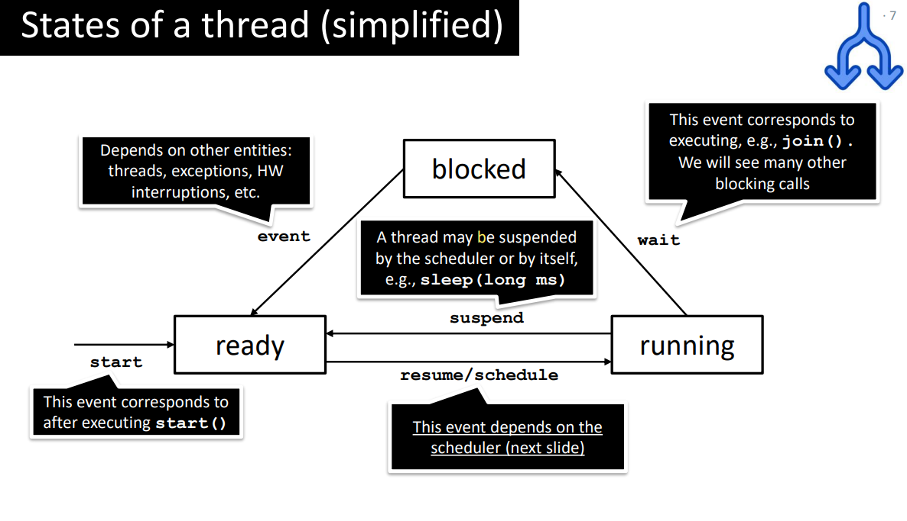

# Topic 1: Intro to concurrency and the mutual exclusion problem

> Goal: \
> Define and motivate concurrency and mutual exclusion.\
> Explain race conditions, critical sections and the happens-before relation. 

<br>

## Motivation for concurrency

1. **<span style="color:DarkTurquoise;">Exploitation</span>**: Hardware capable of simultaneously executing multiple streams of statements.

    To take advantage of multiple cores the software must be written in independent streams of statements can be separated and directed to the different cores/processors.

    A special case is communication and coordination of independent computers on the internet.

    ```toml
    [multiple streams are used to speed up counting the primes]
    
    stream t1= new stream(() -> {
        for (int i=0; i<999999; i++)
            if (isPrime(i)) counter.increment();
    });
    stream t2= new stream(() -> {
        for (int i=1000000; i<1999999; i++)
            if (isPrime(i)) counter.increment();
    });
    stream t3= new stream(() -> {
        for (int i=2000000; i<2999999; i++)
            if (isPrime(i)) counter.increment();
    });
    ```
2. **<span style="color:DarkTurquoise;">Inherent</span>**: Interacting with the environment

    Computer needs to communicate with its environment (eg. to get input or to show results). Sequential programs will stop and wait for the input (think if we have many independent communication channel, eg: multiple buttons Its not convenient). So whenever there is an independent stream of external events that needs the computers attention, there should be an independent stream in its program handling the stream of events.

     ```toml
    [sequential programs will stop and wait]
    
    n= read();
    res= computeNoOfPrimess(n);
    write(res);

    [independent stream for each stream of events]    
    stream searchField= new stream(() -> {
        newText= await(searchField);
            search(newText);
    });
    stream stopApp= new stream(() -> {
        await(stopButton);
        exitApp;
    });

    ```
3. **<span style="color:DarkTurquoise;">Hidden</span>**: Enabling several programs to share resources while each can act as if they had sole ownership.

    Many applications may be active on a smartphone or computer, but most of the time they are idle waiting
for something to happen e.g. an e-mail arriving, download finishing, alarm clock activated etc. Therefore,
the underlying operating system will typically have many streams executing on the same processor (core).
Since each of the streams is idle (waiting) most of the time, none of them will “notice” that other streams are
running on the same processor.
     ```toml
    //e-mail app
    stream Email= new stream(() -> {
        do {
            await(email);
            notify(user);
            store(email_in_inbox);
        } forever
    })
    
    // Stopwatch app
    stream stopWatch= new stream(() -> {
        do {
            alarmAt= await(start button);
            waitUntil(alarmAt);
            notify user;
        } forever
    })
    ```

<br><br>
## Sequential vs Parallel vs Concurrent

1. Sequential: The process of executing tasks or instructions need to run one by one., with each task waiting for the previous one to complete before starting.

2. Parallel: Run multiple tasks simultaneously by using multiple processors or cores.

3. Concurrent: Run multiple tasks at the same time but not really simultaneously. This means task-B can run its process without waiting for task-A to be completed.

    [] Can be executed in one core (as opposed to parallel)
    
    [] Computation may be split in arbitrary blocks (as opposed to sequential) 

<br><br>
## Mutual Exclusion
### 0. Threads in Java
 * A thread is a stream of program statements executed sequentially
 * Each threads works at its own speed (cant make assumption)
 * Each thread has its own local memory
 * Threads can communicate via shared memory
 * 

    * Blocked state: eg: When a thread tries to access a synchronized block or method, but another thread already holds the lock.The thread will move from the blocked state to runnable state when it acquires the lock.
    * Waiting state (not in this picture): The thread will be in waiting state when it calls wait() method or join() method. It will move to the runnable state when other thread will notify.
    - note: this simplifid lifecycle merge Blocked and Waiting state together
### a. Problem in concurrent program

```java
// The output is any value in the interval (2,20_000) 
long counter = 0;
final long PEOPLE = 10_000;

Turnstile turnstile1 = new Turnstile();
Turnstile turnstile2 = new Turnstile();
turnstile1.start();turnstile2.start();
turnstile2.join();turnstile2.join();
System.out.println(counter+" people entered"); 

public class Turnstile extends Thread {
    public void run() {
        for (int i = 0; i < PEOPLE; i++) {
            counter++;
        }
    }
}

/*
    int temp = counter; // (1)
    counter = temp + 1; // (2)
    
    T1(1) T2(1)                                 Counter=0, T1(temp)=T2(temp)=0
    T1(2) ....... (n-2) * [T1(1) T1(2)]         Counter=X, T2(temp)=0
    T2(2) T1(1)                                 Counter=1, T1(temp)=1
    (n-1) * [T2(1) T2(2)]......T2 finsh         Counter=Y, T1(temp)=1
    T1(2)                                       Counter=2
*/
```
To answer this question we need to understand
* **<span style="color:DarkTurquoise;">Atomicity</span>**
  * Atomic statements are executed as a single (indivisible) operation
  * `counter++` is not atomic (aka. `int temp = counter; counter = temp + 1;`)
  * Note: one-liner doesn´t mean it is atomic
* **<span style="color:DarkTurquoise;">States of thread </span>**
  * The statements in a thread are executed when the thread is in its “running” state 


  * 
* **<span style="color:DarkTurquoise;">Non-determinism </span>**
  * In OS, scheduler selects the processes/threads to be execute
  * Threads are selected <span style="color:red;">non-deterministically</span>, i.e., no assumptions can be made about what thread will be executed next
   
    ```toml
    [Consider two threads t1 and t2 in the ready state; t1(ready) and t2(ready)]
    1. t1(running) -> t1(ready) -> t1(running) -> t1(ready) -> …
    2. t2(running) -> t2(ready) -> t2(running) -> t2(ready) -> …
    3. t1(running) -> t1(ready) -> t2(running) -> t2(ready) -> …
    4. Infinitely many different executions!
    ```
* **<span style="color:DarkTurquoise;">Interleavings </span>**
  * An interleaving is a possible sequence of operations for a <u>concurrent program</u>

  * Define interleaving syntax: `<thread>(<step>), <thread>(<step>)`
      ```toml
    [t1(1), t1(2), t2(1), t2(2)] ==> [result = 1]

    public void run() {
        int temp = counter; // (1)
        counter = temp + 1; // (2)
    }
    ```    

* Race Conditions
  * A race condition occurs when the result of the 
computation depends on the interleavings of the 
operations

    | race conditions   | data races     | 
    | --------  | -------- | 
    | A race condition occurs when the result of the computation depends on the interleavings of the operations | A data race occurs when two concurrent threads: <br>(1) Access a shared memory location <br>(2) At least one access is a write <br> (3) There is no happens-before relation between the accesses| 
    | Not all race conditions are data races: <br> *• Threads may not access shared memory* <br> *• Threads may not write on shared memory* | Not all data races result in race conditions <br> *• The result of the program may not change based on the writes of threads <span style="color:yellow;">（then it is Thread-safe program </span>*|
    |   |  | 

    ```java
    // [race conditions but not data race]
    
    public void p() {
        print(“P”) //P1 
    }

    public void q() {
        print(“Q”) //Q1
    }

    Interleaving 1: T1(P1)T2(Q1)
    Output: P Q
    Interleaving 2: T1(Q1)T2(P1)
    Output: Q P
    ```

    ```java
    // [data race but no race conditions]
    
    public void p() {
        x=1; //P1
    }

    public void q() {
        x=1; //Q1
    }

    Interleaving 1: T1(P1)T2(Q1)
    Final state: x==1
    Interleaving 2: T1(Q1)T2(P1)
    Final state: x==1
    ```
* **<span style="color:red;">Answer for the problem in the previous program </span>**
    * The statement counter++ is not atomic
    * Some interleavings result in threads reading stale 
    (outdated) data
    * Consequently, the program has race conditions that result 
    in incorrect outputs

<br>

### b. Solve the problem
* **<span style="color:RoyalBlue;">Critical sections </span>**
  * A critical section is a part of the program that only one thread can execute at the same time（to avoid race conditions）
  * Critical sections should cover the parts of the code handling shared memory
      ```java
    public class Turnstile extends Thread {
        public void run() {
            for (int i = 0; i < PEOPLE; i++) { // 'for' not access shared memory, no need to protect
                // start critical section
                int temp = counter;
                counter = temp + 1;
                // end critical section
            }
        }
    }
    ```
* **<span style="color:RoyalBlue;">Mutual Exclusion </span>**
    * Two or more threads cannot be executing their critical section at the same time
    * ideal solution to the mutual exclusion must ensure the following properties:
      * Mutual exclusion: 
        * at most one thread executing the critical section at the same time
      * Absence of deadlock
        * threads eventually exit the critical section allowing other threads to enter
      * Absence of starvation
        *  if a thread is ready to enter the critical section, it must eventually do so
    * In Java, mutual exclusion can be achieved using the Lock interface
        ```java
        public class Turnstile extends Thread {
            public void run() {
                for (int i = 0; i < PEOPLE; i++) { 
                    l.lock() // 1
                    int temp = counter; // 2
                    counter = temp + 1; // 3
                    l.unlock() // 4
                }s
            }
        }

        // also ensure absence of deadlock, because there is an unlock followed by the lock that is executed unconditionally
        ```
* **<span style="color:RoyalBlue;">Happens-before</span>**
    * operation 𝑎 happens-before than operation 𝑏, denoted as 𝑎 → 𝑏, iff
      * 𝑎 and 𝑏 belong to the same thread and 𝑎 appears before 𝑏 in the thread definition
      * 𝑎 is an unlock() and 𝑏 is a lock() on the same lock
    * In the absence of happens-before relation between operations, the JVM is free to choose any execution order
      * In that case we say that operations are executed concurrently
      * Sometimes denoted as 𝑎 ∣∣ 𝑏
    * We use locks to remove undesired interlavings, and happens-before can help us reasoning about correctness (all interleavings preserving the happens-before relation 
are allowed)      
        ```java
        E1:  t1(l.lock()), t1(int temp=counter), t2(l.lock()), t2(int temp=counter), …
            Because we have t1(l.lock()) → t2(l.lock()) then l.unlock() ↛  l.lock() so this is not a possible interleaving

        E2:  t1(l.lock()), t1(int temp=counter), t1(counter = temp+1), t1(l.unlock()), t2(l.lock()), …
            We have t1(l.unlock()) → t2(l.lock()) which satisfies l.unlock() → l.lock() so this is a possible interleaving

        Summary： 
            by happens-before relation, for all interleavings
                4 → 1
            also 
                1 → 2 and 2 → 3 and 3 → 4
            Then 
                1 → 2 → 3 → 4 → 1 → 2 → ⋯
            Thus, all the interleavings must in a sequence of the form [tX(1), tX(2), tX(3), tX(4)]

        // This prevents (2) and (3) are executed concurrently (which was the source of the race condition above)

        // first time l.lock is executedit isn’t preceded by a l.unlock(), we can think of an implicit unlock happening for any program on all lock
        ```


<br><br>
## Appendix
Two way for stream(threads) coordination : sharing objects and message passing