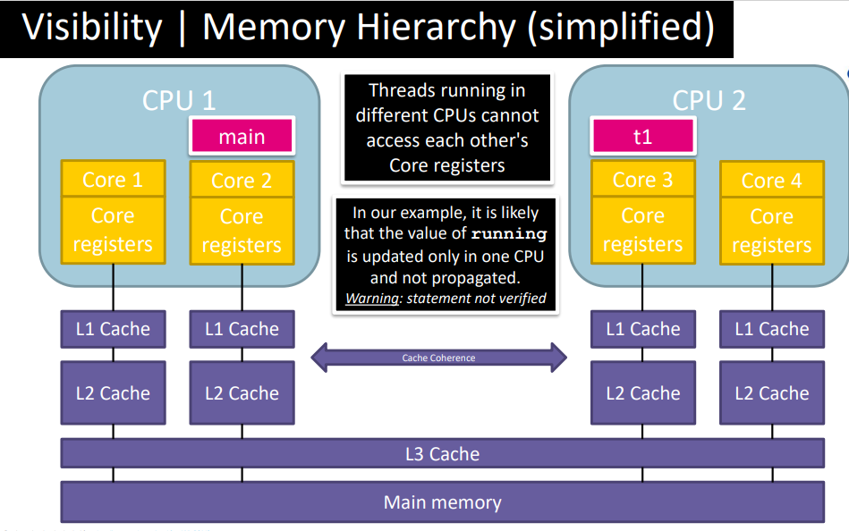

# Topic 2: Shared Memory I

> Goal: \
> Explain and motivate how locks, monitors and semaphores can be used to address the challenges caused by concurrent access to shared memory. 


<br><br>
## Problem in concurrent program 
### **Readers and Writers Problem**
* Consider a shared data structure (e.g., an array, list set, …) where threads may read and write. 
* Many threads can read from the structure as long as no thread is writing.
* At most one thread can write at the same time

<u>Can we solve this problem using locks?</u> No because we need to put threads to wait depending on a condition
<br><br>
## Monitors
### a. Monitor Definition
A monitor is a structured way of encapsulating data, methods and 
synchronization in a single modular package

A monitor consists of:
* Internal state (data)
* Methods (procedures)
    * – All methods in a monitor are mutually exclusive (ensured via locks)
    * – Methods can only access internal state
* Condition variables (or simply conditions)
    * Queues where the monitor can put threads to wait
    
Note: In Java (and generally in OO), monitors are conveniently implemented as classes

Note: <u>Can race conditions appear in a monitor method?</u> No because they only access internal state and all methods are mutually exclusive

```java
/******************************************************************************
* The snippet below shows a common structure for monitors in Java (pseudo-code)
******************************************************************************/

// state variables
    // State variables are accessible to all methods in the monitor
int i = 0;
Lock l = new ReentrantLock();
Condition c = l.newCondition();
…

// method example
    // The method is mutually exclusive (using a ReentrantLock)
public void method(…) {
    l.lock()
    try{
        while(i>0) {
            condition.await() //may throw InterruptedExceptions
        }
    } 
    catch (InterruptedException e) {…}
    finally {l.unlock();}
}
```
### b. Conditions
Conditions are used when a thread must wait for something to 
happen, e.g.,
* A writer thread waiting for all readers and/or writer to finish
* A reader waiting for the writer to finish

Queues in condition variables provide the following interface:
* await() – releases the lock, and blocks the thread (on the queue) ==> the thread will be in block state.
* signal() – wakes up a threads blocked on the queue, if any
* signalAll() – wakes up all threads blocked on the queue, if any

 When threads wake up they acquire the lock immediately (before the 
execute anything else)

<br>


### c. Use Monitors to solve Readers and Writers Problems
First, we define the state of the monitor
```java
public class ReadWriteMonitor {
    private int readers = 0; // current number of reader threads
    private boolean writer = false; // whether a thread is writing
    private Lock lock = new ReentrantLock(); // to ensure mutual exclusion
    private Condition condition = lock.newCondition(); // to selectively decide whether a thread must wait to read/write
    …
}
```
Then, we define four methods to lock and unlock read and write access to the shared resource
```java
public void readLock() {
    lock.lock();
    try {
    while(writer)
        condition.await();
        readers++;
    }
    catch (InterruptedException e) {…}
    finally {lock.unlock();}
}

public void readUnlock() {
    lock.lock();
    try {
        readers--;
        if(readers==0) // not necessary to check whether readers==0. because writers checks readers > 0 after waking up 
            condition.signalAll();
    }
    finally {lock.unlock();}
}
```
```java
public void writeLock() {
    lock.lock();
    try {
        while(readers > 0 || writer)
            condition.await();
         writer=true;
    }
    catch (InterruptedException e) {…}
    finally {lock.unlock();}
}

public void writeUnlock() {
    lock.lock();
    try {
        writer=false;
        condition.signalAll(); // single the condition for other threads to access the resource
threads to access the resource
    }
    finally {lock.unlock();}
}
```
```java
/* 
    "Busy-wait", another way to wait
    
    The main difference with await() is that the thread does not transition to the “blocked” state in "busy wait"

    Generally is a bad idea, threads may consume computing resources to check a condition that has not been updated
*/

public void method(…) {
    l.lock()
    try{
        // busy-wait
        while(i>0) {
            // do nothing
        }
    } 
    catch (InterruptedException e) {…}
    finally {l.unlock();}
}
```
<u>Do we need the while in the locking methods, wouldn´t it 
suffice with an if?</u>

Yes. Threads waiting on a condition variable may spurious wake up. **Java Doc**: 
> "It is recommended that applications programmers always assume that 'spurious wake up' can occur and so always wait in a loop.Condition"

<br>

### d.Fairness in Monitors
```java
ReadWriteMonitor m = new ReadWriteMonitor();
for (int i = 0; i < 10; i++) {
    // start a reader
    new Thread(() -> {
        m.readLock();
        System.out.println(" Reader " + Thread.currentThread().getId() + " started reading");
        // read
        System.out.println(" Reader " + Thread.currentThread().getId() + " stopped reading");
        m.readUnlock();
    }).start();

    // start a writer
    new Thread(() -> {
        m.writeLock();
        System.out.println(" Writer " + Thread.currentThread().getId() + " started writing");
        // write
        System.out.println(" Writer " + Thread.currentThread().getId() + " stopped writing");
        m.writeUnlock();
    }).start(); 
}
```
If we run it, most of the time (or always): first all readers are executed, then all writers are executed.

<u>Reason</u>: Readers can come as long as there are no writers, but writers need to wait until there are 0 readers and also that there are no write. In this example,  writes may <span style="color:red;">**starve** </span>if readers keep coming. [ Note: Absence of starvation == if a thread is ready to enter the critical 
section, it must eventually do so]

* Monitors have two queues where threads may wait
  * Lock queue (a.k.a. entry queue)
  * Condition variable queue
<br>– Note: not behave like queue in Java, more like set, call it here “queues” for historic reasons.
<br>- Note: select(remove) thread from the queue to execute next step is non-deterministically
<br>-<span style="color:YELLOW;">See example on [Slide2, Page24-Page32]</span>
* Examples of fairness:
  * Threads should not be scheduled based on the tasks they perform or their computational costs (e.g., writers threads in our example)
  * If two threads compete to enter the monitor (i.e., execute a method), the thread waiting longest should have priority
* different languages have different signalling semantics for monitors [more details](https://samuel-sorial.hashnode.dev/mesa-vs-hoare-semantics)
    - Mesa semantics: Threads going to the entry queue to compete for entering the monitor again – （Java semantics）
      * when a signal call is made, a thread will be taken out from the Condition variable queue, and will be put on the entry queue. However, this doesn't mean that the thread will run immediately. The scheduler can choose when to run this thread, which means that another thread could have run and changed the state of the object. (its also one of the reason for using while in previous code)
    - Hoare semantics: Threads waiting on a condition variable have preference over threads waiting on the entry queue
        * When a thread calls signal, the scheduler stops the currently running thread, and immediately transfer the execution to one of the waiting threads

**Fix the starvation**
* Use reentrantLock with the fair flag in Java only ensures the writer thread will be scheduled 
fairly, but if there are many readers, it will simply wait again 
in the condition
* Writers may set the writer flag to true to indicate that they are 
waiting to enter
```java
public void readLock() {
    lock.lock();
    try {
        while(writer)
            condition.await();
        readsAcquires++;
    }
    catch (InterruptedException e) {…}
    finally {lock.unlock();}
}

public void writeLock() {
    lock.lock();
    try {
        while(writer)
            condition.await();
        writer=true; // key point
        while(readsAcquires != readsReleases)
            condition.await();
    }
    catch (InterruptedException e) {…}
    finally {lock.unlock();}
}
```
<U>Does this solution ensure that if a writer is ready to write will eventually do it?</U>
Assuming that all threads run to competition, Yes. But remember that the scheduler can still choose to never allow the writer thread to make progress.

<br><br>

## Java Intrinsic Locks | synchronizeds
* In Java, all objects have an intrinsic lock associated to it with a condition variable. It also called monitors.
* Intrinsic locks are accessed via the synchronized keyword
    ```java
    // These two code snippets are equivalent

    // 1
    Lock l = new Lock();
    l.lock()
    try {
        // critical section code
    } finally {
        l.unlock()
    }

    // 2
    Object o = new Object();

    synchronized (o) {  // if exception occurs, the system automatically releases the lock
        // critical section code
    }
    ```
* synchronized can also be used on methods
  * The intrinsic lock associated to an **instance** of the object is used
    ```java
    class C {
        public synchronized T method() {
            …
        }
    }

    <==>

    class C {
        public T method() {
            synchronized (this) {
                …
            }
        }
    }

    //////////////////////////////////////////////
    // (not same lock) synchronized on a regular method uses the instance lock. The two threads use different instances of the object.

    new Thread(() -> {
        c1 = new C();
        c1.method()
    }).start();

    new Thread(() -> {
        c1 = new C();
        c1.method()
    }).start();
    ```
* synchronized can also be used on static methods
  * The intrinsic lock associated the **class** runtime object is used    
    ```java
        class C {
            public synchronized static T method() {
                …
            }
        }

        <==>

        class C {
            public static T method() {
                synchronized (C.class) {
                    …
                }
            }
        }

        //////////////////////////////////////////////
        // (same lock) These two objects use the same lock because they use the class lock, which is the same for all object instances
        new Thread(() -> {
            c1 = new C();
            c1.method()
        }).start();

        new Thread(() -> {
            c1 = new C();
            c1.method()
        }).start();
        ```
* The condition variable in intrinsic locks is accessed via the methods wait(), notify(), notifyAll(), which are equivalent to await(), signal(), signalAll() in ReentrantLock.
* When using synchronized in methods use this.wait(), this.notify(), etc… 
    ```java
    Lock l = new Lock();
    Condition c = l.addCondition()

    l.lock()
    try {
        // critical section code
        while(property)
            c.await();
        …
        c.signalAll();
    } finally {
        l.unlock()
    }

    <==>

    Object o = new Object();
    synchronized (o) {
        // critical section code
        while(property)
            o.wait();
        …
        o.notifyAll();
    }
    ```

<br><br>

## Hardware and Programming Language Concurrency issues
### **a. Visibility**
* To increase performance (hardware optimizations), in the absence of synchronization operations, the CPU is allowed to keep data in the CPU’s registers/cache ==> it might not be visible for threads running on different CPU. <span style="color:YELLOW;">[ More precisely, in the absence of a happen-before relation between statements of different threads, it is not guaranteed that they will see the same shared memory state ]</span>

```java
/*
    possible outputs:
        1： t1 | Main
        2: Main | t1
        3: Main (running==false is never visible to the inner thread)
*/
boolean running = true;
Thread t1 = new Thread(() -> {
    while (running) {
        /* do nothing */
    }
    System.out.println("t1");
})

t1.start();
try{Thread.sleep(500);}catch(…){…}
running = false;
System.out.println("Main");
```


<br>

* analysis

    * Why do visibility problems occur?
        * 1: lack of happens-before relation between operations
        * 2: In the program below, it holds 𝑡1(𝑤ℎ𝑖𝑙𝑒 𝑟𝑢𝑛𝑛𝑖𝑛𝑔 ) ↛ 𝑚𝑎𝑖𝑛(𝑟𝑢𝑛𝑛𝑖𝑛𝑔 ≔ 𝑓𝑎𝑙𝑠𝑒) and 𝑚𝑎𝑖𝑛(𝑟𝑢𝑛𝑛𝑖𝑛𝑔 ≔ 𝑓𝑎𝑙𝑠𝑒) ↛ 𝑡1(𝑤ℎ𝑖𝑙𝑒 𝑟𝑢𝑛𝑛𝑖𝑛𝑔 )
        * 3: Consequently, the CPU is allowed to keep the value of running in the register of the CPU or cache and not flush it to main memory

* solve problem 
    * Establishing a happen-before relation enforces visibility
        * 1: In the program below, it holds 𝑤ℎ𝑖𝑙𝑒 𝑟𝑢𝑛𝑛𝑖𝑛𝑔 → 𝑟𝑢𝑛𝑛𝑖𝑛𝑔 ≔ 𝑓𝑎𝑙𝑠𝑒 or 𝑟𝑢𝑛𝑛𝑖𝑛𝑔 ≔ 𝑓𝑎𝑙𝑠𝑒 → 𝑤ℎ𝑖𝑙𝑒 𝑟𝑢𝑛𝑛𝑖𝑛𝑔
            <br> &nbsp; &nbsp; &nbsp; &nbsp; <u>Note: reason for write “or” here </u>: both interleavings may occur, depending on what threads the scheduler decides to execute first.
        * 2: Consequently, the CPU is not allowed to keep the value of running in the register of the CPU or cache and must flush it to main memory [Concretely, when unlock() is executed, CPU registers and low-level cache are flushed (entirely) to memory levels shared by all CPUs]
        ```java
        /*
            possible outputs:
                1： t1 | Main
                2: Main | t1                
        */
        boolean running = true;
        Object o = new Object();
        Thread t1 = new Thread(() -> {
            while (running) {
                synchronized(o){/* do nothing */}
            }
            System.out.println("t1");
        })

        t1.start();
        try{Thread.sleep(500);}catch(…){…}
        synchronized(o){running = false;}
        System.out.println("Main");
        ```

<br>

### **b. Reordering**
* To increase performance (e.g. parallelizing tasks), In the absence of data dependences or “synchronization”, the 
Just-In-Time (JIT) compiler is allowed to reorder java bytecode operations 
    ```java
    /*
        No data dependencies or synchronization between these instructions               
        Reordering is allowed to perform [see comment]
    */

    // shared variables
    x=0;y=0;
    a=0;b=0;
    
    // Threads definition
    Thread one = new Thread(() -> {
        a=1;   // x=b
        x=b;   // a=1
    });
    Thread other = new Thread(() -> {
        b=1;   // y=a
        y=a;   // b=1
    });

    one.start();other.start();
    one.join();other.join();
    System.out.println("("+x+","+y+")");
    ```
    <u>Can this program output (0,0)?</u> Yes, due to lack of happens-before relation between operations the JVM is allowed to reorder them.

s<span style="color:red;">????????? see slide (P67) interleavings [reordering doesnt obey happed before (1)]</span>

* Establishing a happen-before relation prevents (some) reordering.
    * The intrinsic monitor introduces happens-before relations: 
        - (monitor rule) 𝑜𝑛𝑒(𝑥 ≔ 𝑏) → 𝑜𝑡ℎ𝑒𝑟(𝑏 ≔ 1) or
𝑜𝑡ℎ𝑒𝑟(𝑦 ≔ 𝑎) → 𝑜𝑛𝑒(𝑎 ≔ 1)
    ```java    
    /*
        (monitor rule)
            𝑜𝑛𝑒(𝑥 ≔ 𝑏) → 𝑜𝑡ℎ𝑒𝑟(𝑏 ≔ 1) or 𝑜𝑡ℎ𝑒𝑟(𝑦 ≔ 𝑎) → 𝑜𝑛𝑒(𝑎 ≔ 1)
        (program order rule)
            𝑜𝑛𝑒(𝑎 ≔ 1) → 𝑜𝑛𝑒(𝑥 ≔ 𝑏) and 𝑜𝑡ℎ𝑒𝑟(𝑏 ≔ 1) → 𝑜𝑡ℎ𝑒𝑟(𝑦 ≔ 𝑎)
        Combining these relations, we have
            1 𝑜𝑛𝑒(𝑎 ≔ 1) → 𝑜𝑛𝑒 (𝑥 ≔ 𝑏) → 𝑜𝑡ℎ𝑒𝑟 (𝑏 ≔ 1) → 𝑜𝑡ℎ𝑒𝑟 (𝑦 ≔ 𝑎)
            2 𝑜𝑡ℎ𝑒𝑟(𝑏 ≔ 1) → 𝑜𝑡ℎ𝑒𝑟 (𝑦 ≔ 𝑎) → 𝑜𝑛𝑒 (𝑎 ≔ 1) → 𝑜𝑛𝑒 (𝑥 ≔ 𝑏)

        None of (0,0) interleaving is valid.
    */
    // shared variables
    x=0;y=0;
    a=0;b=0;

    // Threads definition
    Thread one = new Thread(() -> {
        synchronized (o) {
            a=1;   
            x=b;   
        }
    });
    Thread other = new Thread(() -> {
        synchronized (o) {
            b=1;   
            y=a;   
        }
    });

    one.start();other.start();
    one.join();other.join();
    System.out.println("("+x+","+y+")");
    ```

### **Visibility**
#### weak form of synchronization
* Java provides a weak form of synchronization via the variable/field modifier volatile
* **[Ensure visibility]** Volatile variables are not stored in CPU registers or low levels of cache hidden from other CPUs
  * Writes to volatile variables flush registers and low level cache to shared memory levels
    * flashes memory for all variables in CPU registers/cache => ensures visibility to writes on non-volatile variables prior that of the volatile variable
* **[Prevent reordering]** Volatile variables cannot be reordered
* Volatile variables cannot be used to ensure mutual exclusion!  
  * (lock can ensure mutual exclusion, also ensure visibility and prevent reordering, but volatile variables may have a lower impact in performance.)
#### volatile | happens-before
* A write to a volatile variable happens before any subsequent read to the volatile variable
    ```java
    /*
        In this program the output (0,0) is not possible

        Because of volatile and program order we have 
            (Program order)
                𝑜𝑛𝑒(𝑎 ≔ 1) → 𝑜𝑛𝑒(𝑥 ≔ 𝑏) and
                𝑜𝑡ℎ𝑒𝑟(𝑏 ≔ 1) → 𝑜𝑡ℎ𝑒𝑟(𝑦 ≔ 𝑎)
            (Volatile)
                𝑜𝑛𝑒(𝑎 ≔ 1) → 𝑜𝑡ℎ𝑒𝑟(𝑦 ≔ 𝑎) or o𝑡ℎ𝑒𝑟(𝑦 ≔ 𝑎) → 𝑜𝑛𝑒(𝑎 ≔ 1) and
                𝑜𝑡ℎ𝑒𝑟(𝑏 ≔ 1) → 𝑜𝑛𝑒(𝑥 ≔ 𝑏) or 𝑜𝑛𝑒(𝑥 ≔ 𝑏) → 𝑜𝑡ℎ𝑒𝑟(𝑏 ≔ 1)
            None of the interleavings can satisfy these two properties. Thus, (0,0) is not possible
    */

    // shared variables
    x=0;
    y=0;
    volatile a=0;
    volatile b=0;
    
    // Threads definition
    Thread one = new Thread(() -> {
        a=1;   
        x=b;   
    });
    Thread other = new Thread(() -> {
        b=1;   
        y=a;   
    });

    one.start();other.start();
    one.join();other.join();
    System.out.println("("+x+","+y+")");
    ```
    <u>Why isn´t it necessary to declare x and y volatile as well?</u> Because x and y are only read after the join, so there is already a happens-before relation between the write and the read.
