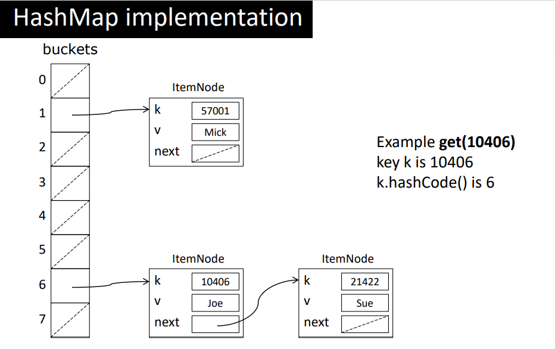
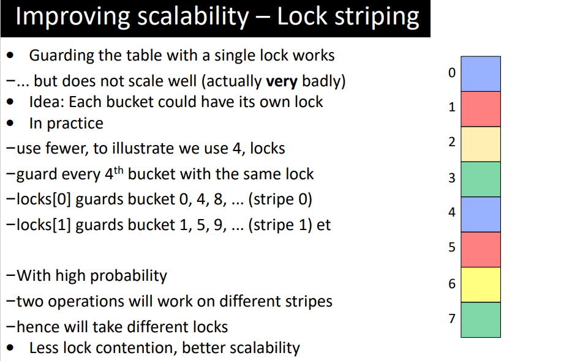

# Topic 6: Performance and Scalabilitys

> Goal: \
> Explain how to increase the performance of Java code using threading. \
Illustrate some of the pitfalls there are in doing this.

## Java Executors - Tasks


* Tasks are a central concept for executors
  * When designing a program using executors, first think about the tasks to be executed
  * Like for threads, tasks can be conveniently defined in their own class
  * Ideally, tasks should be independent (if not, thread satefty must be ensured)
  ```java
  @Override
      public void run() {
          if ((high-low) < threshold) { 
              for (int i=low; i<=high; i++) if (isPrime(i)) lc.increment();
          } else {
              int mid= low+(high-low)/2;
              Future<?> f1 = pool.submit(new countPrimesTask(lc, low, mid, pool, threshold) );
              Future<?> f2 = pool.submit(new countPrimesTask(lc, mid+1, high, pool, threshold) );

              try { f1.get();f2.get(); }
              catch (InterruptedException | ExecutionException e) { }
      }
  }


  class PrimeCounter {
    private int count= 0;
    public synchronized void increment() {
        count= count + 1;
    }
    public synchronized int get() { 
        return count; 
    }
    public synchronized void setZero() {
        count= 0;
    }
  }
  ```
  initializes the Executor service
  ```java
  class PrimeCountExecutor {
        private ExecutorService pool;
        ...
        public PrimeCountExecutor () {
              pool= new ForkJoinPool();
              Future<?> done= pool.submit(new countPrimesTask( ... ));
              try { done.get(); }
        }
    }

    // pool= new ForkJoinPool( n );
    // n specifies the number of CPUs that will be used
  ```
* The ExecutorService can be shut down.
  ```
  pool.shutdown();
  ```
    * After shutdown the pool cannot be reused, but can assign it a new value
* Runnable vs. Callable
  * Both are used to specify the code of a thread
  * Runnable
    * cannot return a result
    * overrides run()
  * Callable
    * returns a result (via a Future)
    * overrides call()
  * Runnables may use shared data (e.g., to deliver a result , in countPrimes example), callable can also use shared data.
  ```java
  public class DotProductTask implements Callable<Integer> {
        final int pos;
        final int[] x, y;

        public DotProductTask(int[] x, int[] y, int pos) {
              this.x = x;
              this.y = y;
              this.pos = pos;
        }

        @Override
        public Integer call() {
            return x[pos] * y[pos];
        }
  }
  ```
  ```java
  List<DotProductTask> tasks = new ArrayList<DotProductTask>();
  
  // Randomly initialize arrays x and y...
  // Create the list of tasks (Futures) to execute
  for (int i = 0; i < N; i++)
        tasks.add(new DotProductTask(x,y,i));
  ...
  // Add all futures to the execution pool at once
  List<Future<Integer>> futures = pool.invokeAll(tasks);
  for(Future<Integer> f : futures) {
        result += f.get(); // Wait for each future to be executed
  
  pool.shutdown();
  ```

* Submit vs Execute
  * Both are used to spawn a tasks
  * pool.execute
    * cannot return a result
  * pool.submit 
    * returns a result (via a Future)

**Scalability, speed-up and loss (of scalablity) classifications**

Quicksort executor

```java
class QuicksortTask implements Runnable {
      Task p; // low and high boundaries
      ExecutorService pool;

      @Override public void run() { qsort(p, pool, ... ); }
      
      public static void qsort(Task p, ExecutorService pool, ... 
      ) { 
            Future<?> lowTask= null; Future<?> highTask= null;

            //split task in two: Low and High
            if (Low.size>= threshold) 
                  lowTask = pool.submit( new QuicksortTask( pLow, pool, ... ))
            else 
                  Quicksort(pLow); //sequential sort
            if (High.size>= threshold) 
                  highTask = pool.submit( new QuicksortTask( pHigh, pool, ... ))
            else 
                  Quicksort(pHigh);
 }

 //Waiting for longest running subtask to finish
try {
        lowTask.get();
        highTask.get();
} catch (InterruptedException | ExecutionException e) { e.printStackTrace(); }

```
* Sorting results (Does not scale perfectly)\
  Executor\
  1 8.5 s\
  2 4.8 s\
  4 2.6 s\
  8 2.2 s\
  16 2.2 s
* Loss of scalability
  * Starvation loss
      * QuickSort (第一阶段划分数组时只用了一个cpu横扫)
      * Minimize the time that the task pool is empty
  * Separation loss (best threshold)
    * Prime count
    * Find a good threshold to distribute workload evenly
  * Saturation loss (locking common data structure)    
    * Minimize high thread contention in the problem
  * Braking loss 
    * String search
    * Stop all tasks as soon as the problem is solved
* What limits performance
  * CPU-bound 
    * Eg. counting prime numbers, sorting, ….
    * To speed up, add more CPUs (cores) (exploitation)
  * Input/output-bound
    * Eg. I/O or reading from network
    * To speed up, use more threads/tasks (inherent)
  * Synchronization-bound (Saturation loss)
    * Eg. Algorithm using shared data structure 
    * To speed up, improve shared data structure (eg. Lock striping)


<br>

**Lock striping**



